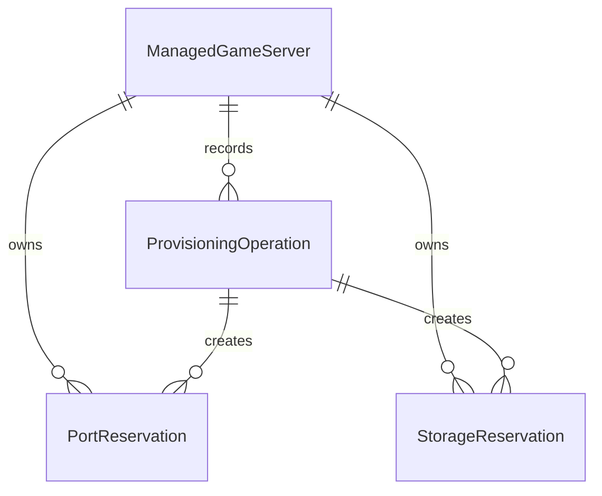

# Persistence

GamesHud uses EF Core with SQLite as its first local persistence provider.

This foundation is intentionally small. It creates the persistence infrastructure, migration lifecycle, health signal and local transaction boundary needed by ownership and allocation work. It does not introduce users, tenants, billing, secret persistence, Docker provisioning, directory creation or public database CRUD.

## Location

The SQLite database is created under the GamesHud data root:

```text
<DataRoot>/system/gameshud.db
```

`DataRoot` comes from `Storage:DataRoot` / `Storage__DataRoot`. When it is empty, the backend uses the existing app-local fallback under `AppContext.BaseDirectory`.

The database path is constructed by the backend. HTTP clients cannot provide a database path, and public API responses must not expose the absolute database path or connection string.

Game server storage remains separate:

```text
<DataRoot>/servers/<gameServerId>
```

The `system` directory is for GamesHud internal state. It is not a game data directory.

## Schema

The initial GH-07.5 schema contains `persistence_metadata`, a technical metadata table used to prove migration and initialization.

GH-07.6 adds the minimum product schema for future managed server provisioning:

- `managed_game_servers`
- `port_reservations`
- `storage_reservations`
- `provisioning_operations`



`managed_game_servers` stores stable game server identity, game id, display name, installation ownership, runtime type, lifecycle state and UTC timestamps.

`port_reservations` stores a durable GamesHud claim for a game server port definition, protocol, port number, exposure, status and creating operation.

`storage_reservations` stores a durable GamesHud claim for a storage definition, managed relative path, ownership, status and creating operation. The relative path is portable and should be reconstructed under `Storage__DataRoot` when a host path is needed.

`provisioning_operations` stores the minimal future operation state for recovery: operation id, server id, type, status, active slot, current step, started/updated/completed timestamps and safe error fields.

EF Core migrations are the source of truth for schema changes. Normal application startup uses migrations, not `EnsureCreated`.

Design-time migration commands should work without Docker, VPS access or Palworld configuration:

```powershell
dotnet tool restore
dotnet tool run dotnet-ef migrations list --project backend/src/GamesHud.Api/GamesHud.Api.csproj --startup-project backend/src/GamesHud.Api/GamesHud.Api.csproj --context GamesHudDbContext
```

## Boundaries

Domain models must not depend on `DbContext`, `DbSet`, EF attributes, SQLite APIs, SQL strings or migration types. Persistence-specific records live under the persistence infrastructure.

The current provider is SQLite. Domain behavior must not rely on SQLite-specific behavior so a future PostgreSQL provider can be designed without changing domain rules.

GamesHud uses UTC timestamps for persisted technical records.

## Reservations

Planning endpoints remain advisory. A reservation is durable GamesHud intent and ownership state.

```text
planning != reservation
reservation != runtime resource created
```

A port reservation does not mean the socket is bound, a firewall rule exists or Docker has published the port.

A storage reservation does not mean the directory exists, a bind mount exists or files have been written.

Future provisioning must use validated reserved plans as its source of mutation and then record step progress, success or failure.

## Constraints

The database enforces:

- unique `managed_game_servers.Id`;
- unique `port_reservations.Protocol + Port`;
- unique `port_reservations.GameServerId + PortDefinitionId`;
- unique `storage_reservations.RelativePath`;
- unique `storage_reservations.GameServerId + StorageDefinitionId`;
- foreign keys from reservations and operations to their managed server;
- foreign keys from reservations to the operation that created them;
- delete behavior is restricted rather than cascade.

TCP and UDP can use the same numeric port because protocol is part of the unique port reservation key.

Only one active operation of the same type can exist for a server. GamesHud uses a nullable `ActiveSlot` column with a unique `(GameServerId, Type, ActiveSlot)` index. Active operations use `active`; terminal operations clear the slot. This avoids SQLite-specific filtered indexes and remains suitable for a future PostgreSQL design.

Current reservation rows are not automatically cleaned up. Stale, failed or abandoned records are intentionally left durable for future recovery logic.

## Startup And Health

Startup is fail-fast for persistence initialization. If the configured data root cannot host the database directory or migrations fail, the API startup fails rather than silently running with unknown persistence state.

`GET /api/system/persistence` reports availability, provider and migration status. It must not return absolute filesystem paths, table names, connection strings or secrets.

## Transactions

The persistence foundation provides a local EF Core transaction boundary for future application operations.

A database transaction only covers database writes. It does not make Docker operations, filesystem writes, backups, container lifecycle changes or future provisioning atomic. Future provisioning still needs explicit step state, durable ownership proof, idempotency and compensation or rollback rules.

`IManagedServerStore.ReserveProvisioningPlanAsync` is the current use-case boundary for atomically writing:

- the managed game server;
- port reservations;
- storage reservations;
- the pending provisioning operation.

If a unique constraint or FK fails, the database transaction rolls back the whole reservation and no partial server should remain.

## Secrets

Secrets are not stored as normal SQLite data. SEC-02 introduces a dedicated secret model and local encrypted provider under:

```text
<DataRoot>/system/secrets
```

Durable resource records must store only opaque `SecretReference` values when future provisioning needs secrets. They must not store plaintext passwords, webhook URLs, tokens, REST credentials, provider paths, plaintext hashes or encryption keys.

The current Palworld server passwords, Palworld REST credentials and Discord webhook URL remain legacy external configuration. GamesHud does not auto-import or migrate them into the secret store.

Database transactions do not cover secret-store writes. Future provisioning must treat database writes, secret writes and Docker/filesystem mutations as separate consistency domains with explicit recovery state.

## Legacy Resources

The existing Palworld server, including "Amigos e Amigos", remains `LegacyExternal`. GamesHud must not import it into SQLite, adopt its paths, modify its Docker container, change its runtime config or treat existence of a path/container/port as ownership.

No user model exists in this schema. Ownership means GamesHud resource ownership, not user, organization or tenant ownership.

## Operations

SQLite file backups are not implemented in this phase. Copying `gameshud.db` while the API is writing is not a safe backup strategy. A future operations task must define database backup, restore and integrity rules.

The database file should live in a controlled backend-only data root. Do not make the `system` directory public. This task does not add chmod/chown automation or claim protection against malicious symlinks, junctions or mount-point races; deeper filesystem hardening belongs to SEC-06 and future provisioning work.
