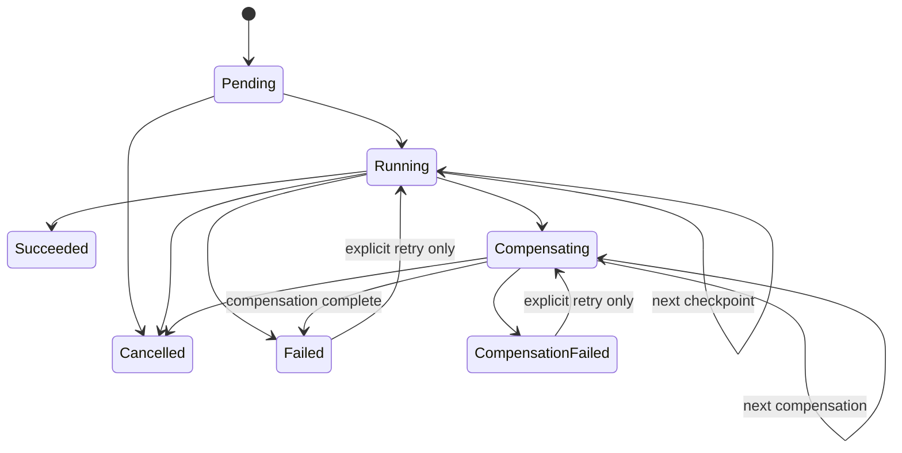
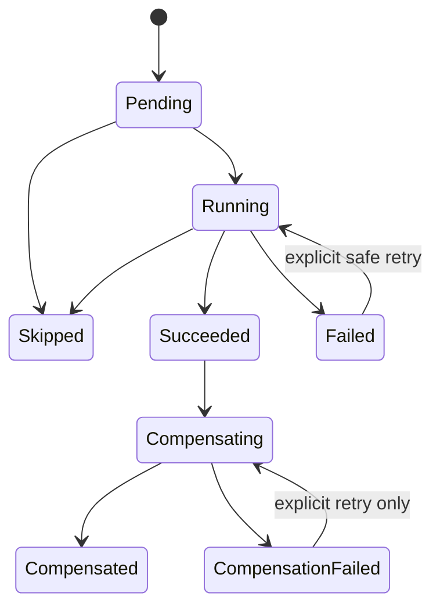

# Provisioning State Machine

GH-08 introduced the internal provisioning engine. GH-09 keeps that engine and makes its operation and step state explicit, durable and recoverable. It still exposes no create-server API and creates no container, directory, volume, network, firewall rule, game installation or configuration file.

## Flow

```text
CreateGameServerProvisioningRequest
-> Validate host and game requirements
-> Build ValidatedProvisioningPlan
-> Reserve server, ports, storage, operation and versioned steps atomically
-> Checkpoint step Running
-> Execute the safe/fake step
-> Checkpoint its outcome
-> Persist terminal operation state or durable compensation progress
```

Planning, reservation and runtime state remain distinct:

```text
plan != reservation
reservation != host mutation
operation succeeded != runtime ready
```

The managed server remains `pending_provisioning` after this foundation succeeds because no runtime exists yet. GH-12 and GH-13 will introduce real game provisioning and health semantics.

## Contracts

`CreateGameServerProvisioningRequest` accepts only `GameServerId`, `GameId` and `DisplayName`. Clients cannot supply host paths, images, mounts, Docker flags, privileged mode or shell commands.

`ValidatedProvisioningPlan` contains only backend-approved decisions: normalized identities, selected runtime from the game definition, host compatibility status and warnings, selected ports, managed relative storage paths, opaque `SecretReference` values and required step ids. It contains no `SecretValue` and no client-supplied host mutation data.

`ProvisioningContext` is typed and carries the operation id, game definition, validated plan, durable reservation result and typed step executions. It does not use `dynamic` or an untyped state dictionary.

## Versioned Pipeline

The stable step ids for pipeline `gh09-v1` are `validate_host`, `plan_resources`, `reserve_resources`, `prepare_storage`, `configure_game`, `create_runtime`, `start_runtime`, `verify_health` and `complete`. Class names, display names and list indexes are not persisted identities.

Reservation stores every expected step, its sequence and its retry/side-effect metadata. Validation, planning and reservation have already completed at that point, so their rows start as `Succeeded` with attempt 1; executable foundation steps start as `Pending` with attempt 0. Recovery reads this persisted pipeline instead of reconstructing history from the current code list. A pipeline version mismatch requires manual intervention.

The engine remains game-neutral. Game-specific requirements, ports, storage and runtime choices come from `GameDefinition` and existing planners. There is no Palworld, Docker, SteamCMD, INI or REST branch in the state machine or recovery service.

## Operation State



`Succeeded` and `Cancelled` have no outbound transitions. `Failed` and `CompensationFailed` can move only through an explicit controlled retry path. The centralized `IProvisioningStateMachine` rejects every other transition; persistence never silently repairs inconsistent state.

## Step State



Operation and step state have separate semantics. Each step stores sequence, status, attempt count, UTC execution timestamps, safe failure type/code/message and compensation timestamps. The first execution changes attempt to 1; a permitted explicit retry increments it again. Arbitrary output, exception text and secret material are not stored.

## Retry Policy

Steps declare one of `safe_to_retry`, `requires_inspection` or `non_retryable`, a bounded `MaxAttempts`, and one of `read_only`, `reservation` or `mutation` for side effects. There is no global retry count and GH-09 enables no automatic mutation retry. A failed read-only step may transition back to `Running` only through an explicit retry while attempts remain. Mutation and reservation steps in an unknown state require reconciliation first.

Failures are minimally classified as `permanent`, `transient` or `unknown`. This metadata supports decisions; it does not create an exception hierarchy or self-healing loop.

## Checkpoints

Before calling a step, the engine atomically checkpoints operation `Running`, the current step and step `Running`. After the call, it atomically checkpoints the typed outcome before advancing. Operation and step changes in one checkpoint share the existing database transaction.

The database transaction cannot include a future external side effect. A process may therefore stop after an external mutation succeeds but before `Succeeded` is stored. Persisted `Running` or `Failed/unknown` on a reservation or mutation step means the effect is uncertain and must never be blindly repeated.

## Recovery

`IProvisioningRecoveryService` loads active/incomplete operations and returns a structured decision:

| Decision | Meaning |
| --- | --- |
| `resume` | The persisted next step has not started, or an interrupted read-only step is explicitly retryable. |
| `reconcile` | A reservation or mutation may have produced an external effect. |
| `manual_intervention` | Pipeline versions differ, compensation is incomplete, or state cannot be proven safe. |
| `terminal` | No recovery action is required. |

At startup, `ProvisioningRecoveryStartupObserver` only classifies incomplete operations and logs operation id, decision, step id and reason code. It does not execute steps, mutate the host or automatically resume any operation.

`IProvisioningStepReconciler` is the future game/runtime adapter boundary. A reconciler may report effect present, absent or ambiguous. GH-09 provides the contract and fake tests only; it does not provide a Docker reconciler. Reconciliation produces a decision and does not silently advance persisted state.

## Cancellation And Compensation

Cancellation before execution persists `Cancelled`. Cancellation while a step is running persists that step as `Failed/unknown`; a non-read-only step retains the active slot because cancellation cannot prove an external effect stopped.

On a typed failure, completed compensating steps run in reverse sequence. Each step is checkpointed `Compensating` before cleanup and `Compensated` after success. A cleanup exception persists both step and operation as `CompensationFailed`, retains the active slot and requires manual intervention. Restart during compensation is classified but not resumed automatically. Full rollback remains GH-15 work.

## Concurrency

Each operation has an integer `Version` concurrency token. Every checkpoint supplies the expected version and increments it atomically, so two workers cannot silently advance the same operation from the same snapshot. The unique active operation slot still prevents concurrent operations of the same type for one server.

This is sufficient for the current single-process architecture and detects optimistic conflicts in SQLite. It is not a distributed lease, worker ownership protocol or lock; those remain future Agent/distributed-execution work.

No public provisioning status or mutation endpoint and no frontend workflow are added in GH-09. GH-10 owns progress presentation.
