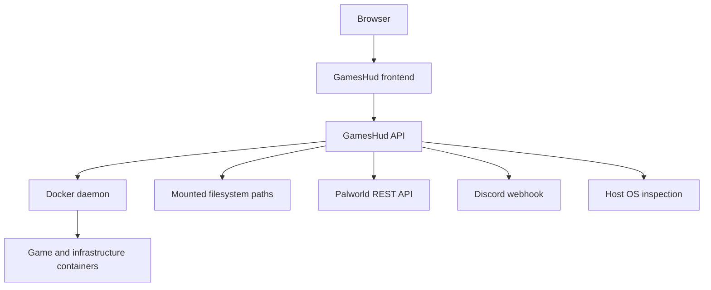
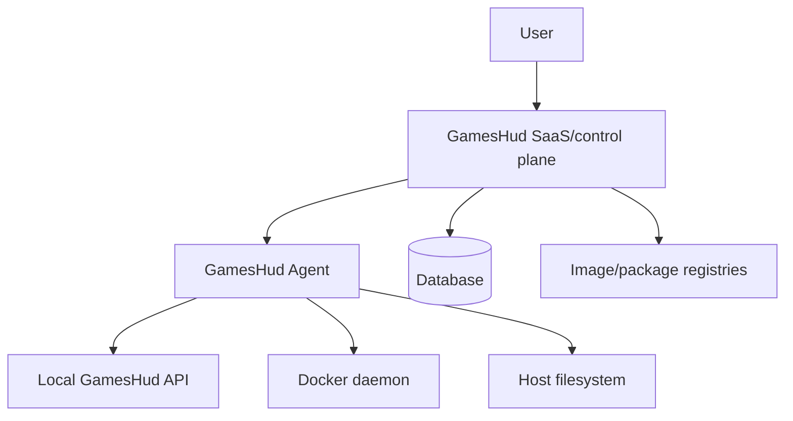

# GamesHud Threat Model

SEC-01 establishes the initial GamesHud threat model. It reflects the current repository state on `develop` after GH-07 and separates current risk from future provisioning, persistence, Agent and SaaS risk.

This is an analysis document. It does not implement authentication, authorization, secrets management, durable ownership persistence, provisioning, Agent, TLS, firewall rules, public deployment or SaaS controls.

## Scope

Current scope:

- Private GamesHud frontend and API.
- Generic Docker Core container list, details, logs and manual lifecycle actions.
- Host capability, metric, port and storage planning endpoints.
- Temporary Palworld settings, REST, backups, updates, player administration, scheduler and notifications.
- Docker Compose private deployment foundation.

Future scope considered:

- Durable server ownership and allocation.
- Generic provisioning.
- Database persistence.
- Authentication and authorization.
- Public access.
- GamesHud Agent.
- SaaS/control plane.

Out of scope for SEC-01:

- Implementing SEC-02, SEC-03, SEC-04, SEC-05 or SEC-06.
- Changing Docker socket architecture.
- Changing backup, restore, update or provisioning code.
- Connecting to VPS or deploying.

## Product Context

GamesHud is moving from a private local panel toward a product where a user can install GamesHud, let it detect host capabilities, choose a game, and eventually provision runtime, storage, ports and configuration. Current implementation is not yet safe for public exposure because there is no authentication, authorization, durable ownership model or audit trail.

The current safety model is:

- The frontend is intended to be reachable only privately.
- The API is intended to be reachable only by the frontend or local/private operators.
- The backend has high host authority through Docker and mounted filesystem paths.
- Palworld features are temporary and configuration-scoped.

## Assets

| Asset | Criticality | Notes |
| --- | --- | --- |
| Host machine | Critical | Docker socket and mounted paths can affect host integrity. |
| Docker daemon and socket | Critical | Backend access can imply host-level control in many deployments. |
| GamesHud API process | Critical | Central authority for Docker, filesystem, REST credentials and operational actions. |
| Palworld game data and saves | Critical | Destructive restore/delete/update flows can permanently affect user data. |
| Backups | Critical | Integrity and availability determine recovery after failed restore/update or data loss. |
| Palworld settings | High | Includes operational settings and password fields. |
| Palworld REST credentials | High | Basic auth credentials allow admin actions against Palworld REST. |
| Discord webhook URL | High | Secret that can be abused for spam or operational misinformation. |
| Docker container metadata | High | Images, mounts, networks and logs may expose infrastructure details. |
| Container logs | High | May contain secrets, tokens, player data or internal paths. |
| Host capability and metrics data | Medium | Reveals OS, CPU, memory, storage, Docker readiness and resource profile. |
| Network configuration and ports | Medium | Can reveal exposed services and planned attack targets. |
| Game definitions | Medium | Trusted internal metadata today; future plugin-supplied definitions become a supply-chain boundary. |
| Storage planning data root | High | Must never become arbitrary client-selected host paths. |
| Scheduler state | High | Can trigger operational actions while the API process is running. |
| Update mechanism | High | Docker image tags, SteamCMD checks and future GamesHud updater are supply-chain sensitive. |
| Repository and build pipeline | High | Compromise can ship malicious code or images. |
| GamesHud SQLite database | Critical | Contains technical persistence and managed server reservation metadata; it must not contain plaintext secret material. |
| GamesHud secret store | Critical | Local encrypted secret material under the backend-only system data root. |
| Secret bootstrap key | Critical | External base64 key used by the local secret provider; compromise decrypts the local store and loss makes secrets unrecoverable. |
| Future user accounts | Critical | Authentication and authorization source of truth. |
| Future provisioning state | Critical | Determines what resources GamesHud owns and may mutate or delete. |
| Future Agent identity | Critical | Remote authority over a host. |

## Trust Boundaries

Current:

Textual boundaries:

- Browser to frontend: untrusted user interactions enter the app.
- Frontend to API: all route params and request bodies are untrusted client input.
- API to Docker daemon: high-privilege infrastructure boundary.
- API to filesystem: host path and mounted path boundary.
- API to Palworld REST: internal service boundary with Basic auth.
- API to Discord webhook: outbound internet boundary.
- API to host inspection: local OS information boundary.
- Deployment network to Palworld network: private Docker network boundary.

Future:

Future boundaries needing design:

- Control plane to Agent.
- Agent to local Docker and filesystem.
- User tenant to tenant data.
- Admin user to ordinary user.
- Provisioning plan to actual mutation.
- Plugin package to trusted runtime.
- Database migrations and backups.

## Attack Surfaces

Current HTTP endpoints:

- Read-only container and log endpoints.
- Manual container lifecycle mutations: `POST /api/containers/{containerId}/start|stop|restart`.
- Game catalog and planning endpoints.
- Port inspection endpoint.
- Host capability and metrics endpoints.
- Server-scoped Palworld overview, players, settings, mods and admin actions.
- Palworld config update.
- Palworld backup create, restore, download and delete.
- Palworld update check and apply.
- Scheduler create/update and run.
- Notification settings and test webhook.

Current mutation endpoints:

- `POST /api/containers/{containerId}/start`
- `POST /api/containers/{containerId}/stop`
- `POST /api/containers/{containerId}/restart`
- `PUT /api/palworld/config`
- `PUT /api/servers/{serverId}/settings`
- `POST /api/servers/{serverId}/announcements`
- `POST /api/servers/{serverId}/players/{userId}/kick`
- `POST /api/servers/{serverId}/players/{userId}/ban`
- `POST /api/servers/{serverId}/players/unban`
- `POST /api/palworld/backups`
- `POST /api/palworld/backups/{backupId}/restore`
- `DELETE /api/palworld/backups/{backupId}`
- `POST /api/palworld/update`
- `POST /api/scheduler`
- `POST /api/scheduler/{id}/run`
- `POST /api/settings/notifications/test`

Other current surfaces:

- Docker socket.
- Palworld mounted data path.
- Palworld backup path.
- Backup archive extraction.
- Docker exec used by update check.
- Palworld REST outbound requests.
- Discord webhook outbound request.
- Logs returned as plain text.
- Docker container details with mounts and network metadata.
- Configuration values loaded from environment and appsettings.

Future surfaces:

- Container creation.
- Bind mounts and Docker volumes.
- Directory creation and deletion.
- Network and firewall changes.
- Game image selection and download.
- Server names and install options.
- Database read/write paths.
- Remote Agent command channel.
- Public API, browser sessions and cross-site requests.
- Plugin packages and update mechanism.

## STRIDE Analysis

Spoofing:

- Current: no authentication means any party that reaches the private API can act as an operator.
- Current: container IDs/names are route parameters; Docker decides which container is targeted.
- Future: Agent identity, user login, tenant identity and plugin identity require explicit verification.

Tampering:

- Current: lifecycle, settings, backup restore/delete, scheduler and update endpoints mutate container or filesystem state.
- Current: backup metadata and archives live as files; local tampering can affect restore trust.
- Future: provisioning can tamper with Docker networks, mounts, environment variables, data roots and database state.

Repudiation:

- Current: there is no durable audit trail tying actions to a user or request.
- Current: scheduler state is in memory and resets on restart.
- Future: public/multi-user deployment requires audit logs for destructive and privileged actions.

Information Disclosure:

- Current: Docker container details expose mount sources and network identifiers.
- Current: logs may contain secrets or player data from containers.
- Current: host capability/metrics expose infrastructure profile.
- Current: Palworld player IPs are intentionally not returned, and password settings return `hasValue` rather than plaintext.
- Future: public access and SaaS require strict data minimization, tenancy boundaries and redaction.

Denial of Service:

- Current: repeated logs, metrics, port checks, backup, restore, update and scheduler actions can consume CPU, disk, network and downtime.
- Current: backup creation and restore can be disk-heavy; restore stops the configured container.
- Future: provisioning retries and partial failures can create resource exhaustion or orphaned resources.

Elevation of Privilege:

- Current: compromise of the backend with Docker socket access can become host compromise in many deployments.
- Current: Docker exec exists for fixed Palworld update commands.
- Future: arbitrary container creation, mounts or commands can directly grant host-level privileges if not constrained.

## Docker Socket Assessment

The Docker socket is a Critical asset. The backend can list, inspect, start, stop and restart containers today, and it also uses Docker exec for fixed Palworld update checks. The current implementation does not expose arbitrary Docker create, exec, mount, image pull or volume APIs to clients, which limits the current command surface.

However, API compromise with unrestricted Docker daemon access can be equivalent to host compromise in many practical Docker deployments. Future provisioning increases this sharply because container creation with privileged mode, host filesystem bind mounts, Docker socket mounts or host networking can cross the host boundary.

Current mitigations:

- Docker access is backend-only.
- Frontend never mounts or receives Docker credentials.
- Compose mounts the Docker socket only into `gameshud-api`.
- Current lifecycle actions are limited to start, stop and restart.
- Controllers map SDK models to GamesHud contracts.

Remaining risk:

- No auth means network reachability to the API is effectively operator authority.
- Docker container details expose sensitive infrastructure metadata.
- Future provisioning cannot safely reuse raw Docker privileges without a strict validated plan and ownership model.

Required actions:

- SEC-03 authentication before public access.
- SEC-04 authorization and ownership before multi-user or multi-server destructive actions.
- GH-07.5 durable ownership before managed deletes or adoption.
- GH-08 provisioning must deny privileged containers, arbitrary mounts, arbitrary env secrets and arbitrary commands by default.
- SEC-05 audit logging before public or multi-user destructive operations.

## Filesystem and Storage Assessment

Current storage planning from GH-07 provides strong path-string guarantees:

- Client supplies only `gameServerId`, not a host path.
- Unsafe server id segments are rejected.
- Planned paths are confirmed inside `Storage__DataRoot`.
- Simple public response exposes relative paths, not absolute managed paths.
- Planning does not create directories or adopt existing data.

Current Palworld filesystem operations:

- Settings file is resolved under configured managed path.
- Settings writes use backup and temporary file flow.
- Backups reject overlapping managed and backup paths.
- Backup ids are backend-generated and validated.
- Restore validates tar entry paths, rejects absolute paths, `..`, backslashes and unsupported entry types.
- Restore deletes managed directory contents and copies extracted files from a temporary restore directory.

Best-effort or remaining filesystem risks:

- Path containment is mostly string/path API based and does not fully model symlinks, junctions or mount-point races.
- TOCTOU can exist between validation and read/write/delete/copy operations.
- Restore delete/copy can follow filesystem behavior for existing symlinks or unusual permissions.
- Archive bombs and very large files are not yet modeled with explicit decompressed size, file count or depth limits.
- Backup archive integrity is local-file based; no signing or checksum trust boundary exists yet.
- Future managed delete is unsafe until ownership and allocation are durable.

Required actions:

- GH-07.5 durable storage ownership before delete/adoption.
- SEC-02 secret-safe config storage before persisting sensitive server config.
- Future backup hardening: max archive size, max expanded size, file count/depth limits, checksum/integrity metadata and symlink/junction policy.
- Provisioning must create and mutate only owned paths from validated plans.

## Port Management Assessment

Current port checks are advisory:

- TCP and UDP are checked separately.
- Docker published ports are diagnostic context.
- Preferred and bounded alternative candidates are returned.
- No firewall rule is opened and no Docker port is published.

Remaining risk:

- TOCTOU exists between port check and future bind/publish.
- Another process can claim a candidate after planning.
- No durable reservation exists.
- Future public/internal exposure metadata must map to concrete firewall and Docker publish behavior safely.
- Privileged ports and host networking need explicit policy before provisioning.

Required actions:

- Durable port reservation before provisioning claims a port.
- Explicit public/internal exposure policy before firewall or publish changes.
- Provisioning rollback for partially created port/firewall state.

## Provisioning Future Assessment

GH-08 will be a major security boundary change. Before or during provisioning, GamesHud needs:

- Durable ownership model for servers, storage, ports, networks and runtime resources.
- Validated plan as the only source of mutation.
- No arbitrary host path input.
- No arbitrary image, command, entrypoint or env injection from clients.
- Image allowlist or signed/pinned image policy.
- Secret handling separate from normal config and response DTOs.
- Atomic-ish creation flow with explicit partial failure state.
- Rollback rules that delete only resources GamesHud owns.
- Idempotency keys or equivalent retry safety.
- Audit events for all mutating steps.
- Deny-by-default Docker capabilities, privileged mode, host network, host PID/IPC and Docker socket mounts.

## Input Validation

Trusted internal metadata today:

- Code-backed game definitions.
- Palworld setting schema.
- Fixed scheduler action type set.
- Fixed update check commands.

Untrusted client input:

- Route params: `containerId`, `gameId`, `serverId`, `backupId`, `userId`, protocol and port.
- Request bodies: settings updates, backup notes, confirmation text, scheduler tasks, announcements, player action messages, storage plan `gameServerId`.
- Query params: lifecycle timeout, log tail/search/stream, history hours, restart flag.

Validation observations:

- Game ids, server ids and storage server ids are normalized or validated.
- Backup ids use a strict regex.
- Scheduler action types are closed.
- Settings schema controls allowed keys, types, ranges and password preservation behavior.
- Player/admin messages have length and character restrictions.
- Logs search and tail are bounded.
- Container IDs are passed to Docker. This is acceptable for the current Docker Core but becomes authorization-sensitive once auth exists.

## Secrets Assessment

Current secrets:

- Palworld `ServerPassword` and `AdminPassword` in the settings file.
- Palworld REST username and password from backend configuration.
- Discord webhook URL from backend configuration.
- Docker endpoint configuration.
- Environment variables in deployment.
- Future database connection strings and signing keys.
- Future managed game-server passwords, webhooks, REST credentials and integration tokens stored through the GamesHud secret model.

Where secrets enter:

- Environment variables, appsettings and local ignored files.
- Palworld settings update requests for password fields.
- Palworld REST Basic auth configuration.

Where secrets are stored or loaded:

- Palworld settings file stores Palworld server/admin passwords.
- Runtime configuration loads REST credentials and webhook URL into backend options.
- The SEC-02 local provider stores future managed secrets as authenticated encrypted files under `<DataRoot>/system/secrets`.
- The SEC-02 local provider gets its 32-byte base64 bootstrap key from external configuration such as `Secrets__MasterKey`.

Exposure controls observed:

- Password settings return `value: null` plus `hasValue`.
- REST credentials are not sent to frontend.
- Discord webhook response only reports configured/not configured.
- Container environment variables are not exposed through mapped container contracts.
- `SecretValue.ToString()` and JSON serialization do not reveal plaintext.
- `GET /api/system/secrets` reports only readiness state and does not return ids, purposes, counts, paths, key details or material.
- Missing, corrupted or wrong-key secret reads fail closed.

Remaining risks:

- Logs from Docker containers may contain secrets.
- Exceptions/log events must continue avoiding credential values.
- Config files and environment variables are plain configuration, not encrypted secret storage.
- `Secrets__MasterKey` is a bootstrap secret. Anyone who can read it can decrypt the local provider's stored material.
- No local mechanism protects secrets from an attacker with GamesHud process control, root/administrator control or memory inspection capability.
- .NET managed strings cannot provide secure memory zeroization guarantees.
- Secret-file deletion is not secure erase on SSDs, snapshots, journals or backups.
- Game backups are separate from secret-store backups and must not include secret files by default.

SEC-02 controls implemented:

- Provider-neutral `SecretId`, `SecretReference`, `SecretPurpose` and `SecretValue`.
- `ISecretStore` boundary for store, retrieve, replace and delete.
- Local authenticated encryption provider with no custom crypto and no plaintext fallback.
- Bootstrap key strategy documented in [Secrets Management](secrets-management.md).
- Minimal readiness endpoint only.
- Tests for roundtrip, replacement, deletion, missing/corrupted/wrong-key failures, serialization redaction, DB separation, endpoint minimization and no hardcoded production key.

## Authentication and Authorization Assessment

Current product is private/local and has no auth. If the API is exposed beyond the intended private boundary, reachable clients can:

- Start, stop and restart arbitrary Docker containers accepted by Docker.
- Read container logs and details.
- Create, restore, delete and download Palworld backups.
- Update Palworld settings.
- Kick, ban and unban players.
- Run scheduler actions.
- Trigger update flow.
- Trigger Discord notification tests.

SEC-03 requirements:

- Secure admin login.
- Session or token lifecycle.
- CSRF strategy if cookie-based.
- Rate limits and lockouts.
- Secure defaults for local/private setup.
- Public deployment blocked unless auth is configured.

SEC-04 requirements:

- Resource ownership model.
- Per-server authorization.
- Separation of read, operational, destructive and admin permissions.
- Authorization checks before every mutating endpoint.
- No authorization based only on frontend visibility.

## SSRF and Network Request Assessment

Current network requests:

- Palworld REST API base URL comes from backend configuration, not client input.
- Discord webhook URL comes from backend configuration and must be HTTPS.
- Docker endpoint comes from backend configuration.
- SteamCMD update checks execute inside the configured Palworld container through fixed commands.

Current SSRF risk is limited by lack of client-controlled URLs. Future risk increases if install options, plugin definitions, Agent registration, webhook configuration, image registries or control-plane callbacks accept user-provided URLs.

Future controls:

- Deny link-local metadata endpoints unless explicitly required.
- Block loopback/internal targets for untrusted outbound URLs, or require explicit admin allowlists.
- Separate control-plane URLs from game-server URLs.
- Validate DNS rebinding-sensitive flows.
- Log destination classes without logging credentials.

## Command Execution Assessment

Current command execution:

- No `Process.Start`, PowerShell or host shell execution was found in backend source.
- Docker exec is used in `DockerPalworldContainerCommandService`.
- Palworld update uses fixed command arrays for `sh -lc` checks inside the configured Palworld container.
- Scheduler does not accept shell commands and supports only closed action types.

Current risk:

- Docker exec is not client-arbitrary today, but backend compromise or future dynamic commands would be dangerous.
- Fixed `sh -lc` strings are still shell parsing inside a container and must not receive untrusted interpolation.

Future controls:

- Provisioning must not build shell commands from untrusted input.
- Prefer structured SDK APIs or fixed argument arrays.
- If commands become necessary, use allowlisted templates and explicit parameter escaping.
- Agent command execution requires mutual authentication and command authorization.

## Logging Assessment

Current logging:

- API logs unexpected errors and Docker/Palworld failures.
- Docker logs are returned to frontend as plain text and downloaded as text snapshots.
- Frontend does not use `dangerouslySetInnerHTML` for logs.

Risks:

- Docker logs can contain secrets, tokens, IPs or private paths produced by managed containers.
- Backend exception logs could include SDK exception details.
- Audit-quality logs do not exist.
- Player identifiers and operational events may need privacy review before SaaS.

Future controls:

- Redaction rules for known secret shapes and configured secret values.
- Bounded log retention and download controls.
- Audit trail separate from diagnostic logs.
- Avoid logging request bodies for sensitive endpoints.

## Backup and Restore Assessment

Current strengths:

- Strong confirmation for restore and delete.
- Pre-restore backup before destructive restore.
- Last valid completed backup cannot be deleted.
- Backup path must be separate from managed path.
- Archive extraction rejects traversal and unsupported entry types.

Remaining risks:

- Restore is destructive and stops the configured container.
- Archive bombs are not yet bounded by expanded size/file count.
- Local tampering with archive and metadata can affect restore.
- Symlink/junction and permission edge cases need deeper hardening.
- Retention deletes automatic backups; misconfiguration can delete data in an unintended backup directory.

Future controls:

- Archive size and expanded-size limits.
- Integrity metadata or checksums.
- Owner and server-id binding for backups.
- Per-resource authorization and audit events.
- Dry-run restore validation where possible.

## Update and Supply Chain Assessment

Current update-related surfaces:

- Docker images are used for GamesHud and Palworld.
- `latest` style or mutable tags may exist in external Palworld deployment outside GamesHud control.
- NuGet and npm dependencies build GamesHud.
- SteamCMD checks run inside Palworld container.
- Future GamesHud updater is not implemented.

Risks:

- Mutable image tags can change behavior without review.
- Compromised package dependency or image registry can ship malicious code.
- Future auto-update could install malicious or incompatible versions.
- Docker exec update checks rely on commands inside the Palworld container.

OPS recommendations:

- OPS-01: run automated backend, frontend and migration validation for integration changes. (Completed)
- OPS-02: add dependency, source and image scanning plus dependency and runtime-image review.
- OPS-03: define release versioning, build provenance, SBOM and update verification.
- OPS-04: define operational rollback and backup validation before update workflows are expanded.

## Database Assessment

GH-07.5 introduces EF Core + SQLite for technical persistence metadata under the GamesHud data root. GH-07.6 adds durable managed game server records, ownership, port reservations, storage reservations and minimal provisioning operation records. It does not persist users, tenants, secrets or execute provisioning.

Current controls:

- Database path is derived internally from `Storage__DataRoot` as `<DataRoot>/system/gameshud.db`.
- HTTP clients cannot supply a database path.
- The persistence health endpoint does not expose the absolute path or connection string.
- EF Core migrations are versioned and are the schema source of truth.
- Startup initialization fails closed if migrations cannot run.
- GH-07.5 started with only technical metadata before GH-07.6 added product reservation tables.
- Managed server schema uses relational tables rather than a mega JSON column.
- Port uniqueness is enforced by `protocol + port`, allowing TCP and UDP to share the same number.
- Managed storage relative paths are unique and do not use absolute host paths as identity.
- A nullable active operation slot enforces one active operation of a type per server without SQLite-specific filtered indexes.
- Reservation writes are transactional and rollback on conflicts.

Remaining persistence threats:

- SQL injection or unsafe query construction.
- Resource ownership tampering.
- Tenant isolation failure if SaaS exists later.
- Secret storage in plaintext.
- Migration tampering or partial migration failure.
- Database file permission weakness in local install.
- Backup/restore of database with inconsistent filesystem state.
- Concurrency races between provisioning, scheduler and manual actions.
- Trusting client-provided ownership ids.

Required controls:

- Parameterized queries or ORM-safe patterns.
- Durable ownership and state transitions.
- Migration integrity and backup plan.
- Secret classification before storing sensitive values.
- Optimistic concurrency or locking for provisioning state.

## Future Agent Assessment

A future GamesHud Agent will likely have high authority over a machine. It needs a separate architecture review before implementation.

Threats:

- Agent spoofing.
- Control plane compromise issuing privileged commands.
- Replay of old commands.
- Remote code execution through command payloads.
- Secret distribution leakage.
- Agent update compromise.
- Tenant-to-agent confusion.
- Over-broad local privileges.

Required controls:

- ARCH-01 Agent architecture before implementation.
- Mutual authentication.
- Per-command authorization.
- Replay protection and expiry.
- Least privilege local runner.
- Signed updates.
- Explicit command schema, no arbitrary shell.
- Emergency revoke and disable path.

## Threat Register

| ID | Threat | Component | Attack scenario | Impact | Likelihood | Severity | Current mitigation | Remaining risk | Required action | Target milestone |
| --- | --- | --- | --- | --- | --- | --- | --- | --- | --- | --- |
| THR-001 | Unauthenticated API access | API | API is exposed beyond SSH/private network and attacker calls mutating endpoints. | Full operational control of Docker/Palworld flows. | Medium if misdeployed | Critical | Docs require private access. | No technical auth gate. | Implement auth and block public exposure until configured. | SEC-03 |
| THR-002 | Docker socket host compromise | Docker | Backend compromise uses Docker daemon authority to control host. | Host compromise. | Medium | Critical | Socket API-only; no arbitrary create today. | Docker daemon remains highly privileged. | Least-privilege provisioning policy and hardening. | GH-08, SEC-06 |
| THR-003 | Unsafe provisioning mutation | Provisioning | Future provisioning creates privileged container, arbitrary mount or unsafe env. | Host/data compromise. | Future medium | Critical | Provisioning not implemented. | Needs design before GH-08. | Validated plans, allowlists, deny privileged defaults. | GH-08 |
| THR-004 | Destructive restore data loss | Backups | Restore deletes managed path contents or restores wrong archive. | Game data loss. | Medium | High | Strong confirmation, pre-restore backup, archive validation. | TOCTOU, local tampering, archive bombs. | Backup integrity and restore hardening. | OPS-04 |
| THR-005 | Arbitrary container lifecycle | Docker Core | Attacker stops/restarts important containers by id/name. | Outage. | Medium if API reachable | High | Frontend confirmations only; API scoped to start/stop/restart. | No authz or protected-container policy. | Authz and resource ownership. | SEC-04 |
| THR-006 | Secret leakage through logs | Logs | Container logs contain secrets and are returned/downloaded. | Credential disclosure. | Medium | High | Logs treated as text; bounded tail. | No redaction. | Secret redaction and log policy. | SEC-02, SEC-05 |
| THR-007 | Host path disclosure | Container details | Container details expose mount source paths. | Infrastructure disclosure, attack targeting. | Medium | Medium | No env vars; labels filtered. | Mount sources still returned. | Authz/minimized admin contracts. | SEC-04 |
| THR-008 | Network fingerprint disclosure | Container details | Network IP/gateway/MAC returned to clients. | Infrastructure fingerprinting. | Medium | Medium | Private access assumption. | No auth/minimization. | Reduce or protect network details. | SEC-04 |
| THR-009 | Palworld REST credential misuse | Palworld REST | Backend sends Basic auth to configured REST URL; config leak or URL abuse exposes credentials. | Server admin compromise. | Low current | High | Backend-only config, not frontend; SEC-02 secret store exists for future managed flows. | Current Palworld REST credentials remain legacy external configuration; SSRF controls are future work. | Explicit credential migration plus URL allow policy if user-configurable. | SEC-02, SEC-06 |
| THR-010 | SSRF through future URLs | Network | Future user-controlled URL causes API/Agent to hit internal services or metadata endpoints. | Internal data exposure or control. | Future medium | High | Current URLs config-only. | Future installer/plugins may add URLs. | Outbound URL policy. | SEC-06 |
| THR-011 | Scheduler abuse | Scheduler | Attacker enables/runs restart, shutdown, backup or announcement tasks. | Downtime, spam, disk usage. | Medium if API reachable | High | Closed action set, in-memory state. | No auth/audit. | Authz and audit. | SEC-04, SEC-05 |
| THR-012 | Backup archive bomb | Backups | Malicious or tampered archive expands massively during restore. | Disk exhaustion, outage. | Low current | Medium | Entry path/type validation. | No expanded-size/file-count limits. | Archive limits and integrity metadata. | OPS-04 |
| THR-013 | Filesystem symlink/junction escape | Filesystem | Symlink/junction changes between validation and write/delete/copy. | Data loss outside intended path. | Low-medium | High | String containment checks. | Not full realpath/open-handle guarantees. | Symlink policy and safer file operations. | GH-07.5, OPS-04 |
| THR-014 | Port TOCTOU | Ports | Port appears free in plan but is taken before bind/publish. | Failed provisioning or wrong exposure. | High future | Medium | Advisory language. | No durable reservation. | Durable reservation and provisioning locks. | GH-07.5/GH-08 |
| THR-015 | Unexpected public exposure | Ports/Provisioning | Internal port metadata becomes public Docker publish or firewall rule. | Exposed admin API/game admin surface. | Future medium | High | Exposure metadata only today. | No publish/firewall implementation. | Explicit exposure policy and review gate. | GH-08 |
| THR-016 | Repudiation of destructive actions | API | User denies restore/delete/restart/update; no durable actor log exists. | Investigation and accountability failure. | Medium future | Medium | Timestamps in responses. | No user identity or audit log. | Audit events. | SEC-05 |
| THR-017 | Update supply-chain compromise | Updates | Compromised image/package/Steam workflow changes binaries. | Code execution or data loss. | Medium | High | Manual update flow, backup first; OPS-01 validates source builds and tests. | No scanning, signing or complete pinning policy. | Release/image/dependency integrity controls. | OPS-02, OPS-03 |
| THR-018 | Future database tampering | Database | Attacker changes ownership/allocation records. | Unauthorized mutation/deletion. | Future medium | High | GH-07.6 stores ownership and reservations with relational constraints. | Authz, audit and backup integrity still need design. | Authorization, audit, migration and backup integrity. | SEC-04/SEC-05/OPS-04 |
| THR-019 | Future Agent command compromise | Agent | Control plane or attacker sends privileged command to Agent. | Remote host compromise. | Future medium | Critical | Agent not implemented. | Requires architecture. | Mutual auth, command auth, replay protection. | ARCH-01 |
| THR-020 | Player admin abuse | Palworld admin | Attacker kicks/bans/unbans players or sends announcements. | Community disruption. | Medium if API reachable | Medium | Strong confirmation for destructive player actions. | No auth/ownership. | Authz and audit. | SEC-04, SEC-05 |
| THR-021 | Notification webhook abuse | Notifications | Attacker triggers webhook test or operational spam. | External spam, incident confusion. | Low-medium | Medium | HTTPS webhook, cooldown for non-test events. | Test not cooldown-gated, no auth. | Auth and audit; consider test rate limit. | SEC-03, SEC-05 |
| THR-022 | Malicious game/plugin definition | Plugins | Future plugin declares unsafe runtime targets, ports or install metadata. | Unsafe provisioning. | Future medium | High | Definitions code-backed today. | Future plugin trust undefined. | Plugin trust/signing/review model. | v0.13, SEC-06 |
| THR-023 | CSRF on private/public API | Browser/API | If cookie auth is added without CSRF controls, web pages trigger destructive POSTs. | Unauthorized actions. | Future medium | High | No cookie auth today. | Must be considered with auth design. | CSRF strategy. | SEC-03 |
| THR-024 | Denial through expensive reads | Logs/Metrics | Repeated log/metrics/capability calls consume resources. | API slowdown. | Medium | Medium | Bounded log tail/history. | No rate limits. | Rate limits and quotas before public access. | SEC-06 |
| THR-025 | Config path misconfiguration | Palworld config/backups | Operator points managed/backup paths to wrong host mount. | Wrong data changed/deleted. | Medium | High | Docs, overlap rejection, existing path checks. | No ownership/adoption marker. | Managed ownership markers and setup validation. | GH-07.5 |
| THR-026 | Secrets persisted without model | Future persistence | Database stores tokens/passwords in normal fields and returns them. | Credential compromise. | Future medium | High | Current SQLite schema stores no secrets; SEC-02 provides opaque references, encrypted local storage and response redaction rules. | Future features could bypass the boundary or mishandle partial failures across persistence domains. | Enforce `SecretReference` and `ISecretStore` in every durable secret flow. | SEC-02 |
| THR-027 | Partial provisioning failure | Provisioning | Directory/container/network created but API reports success or retries unsafely. | Orphaned resources, data loss. | Future high | High | Provisioning not implemented. | Needs state machine. | Explicit step states, idempotency and rollback. | GH-08 |
| THR-028 | Container exec expansion | Docker exec | Future feature lets user or plugin influence exec command. | Container or host escape path. | Future medium | High | Current exec commands fixed. | No generic command policy yet. | No arbitrary command input; allowlisted templates. | SEC-06/GH-08 |

Severity counts:

- Critical: 4
- High: 15
- Medium: 9
- Low: 0

## Security Gates

| Feature | Security prerequisite |
| --- | --- |
| Public access | SEC-03 authentication, SEC-04 authorization, SEC-05 audit, SEC-06 API hardening. |
| Durable persistence | Ownership model, migration integrity, DB backup strategy, secret classification. |
| Secrets persistence | SEC-02 secret management and redaction. (Completed for the local foundation.) |
| Managed storage allocation | GH-07.5 ownership records, no adoption without explicit reviewed flow. |
| Managed delete | Durable ownership proof and audit events. |
| Generic provisioning | Validated plan, ownership, rollback, idempotency, image policy, mount policy, authz. |
| Docker volume/bind mount creation | No arbitrary host paths, allowlisted roots, containment plus symlink policy. |
| Firewall or public port publishing | Exposure policy, durable reservation, authz, rollback. |
| Container creation | Image allowlist/pinning, deny privileged/host namespaces/Docker socket by default. |
| Scheduler persistence | Authz, audit, concurrency and durable state model. |
| Backup restore expansion | Backup integrity, archive limits, ownership binding, audit. |
| Remote Agent | ARCH-01 with mutual auth, command auth, replay protection and signed updates. |
| SaaS/control plane | Auth, authorization, tenant isolation, audit, data residency and Agent hardening. |
| Plugin marketplace | Plugin trust/signing/review, permissions and sandbox story. |

## Security Invariants

Permanent invariants are maintained separately in [Security Invariants](security-invariants.md).

## Milestone Dependencies

Existing or implied cards before future GH work:

- GH-07.5 durable storage ownership before managed delete, adoption or persistent allocation.
- GH-07.6 database design before durable multi-server persistence. (Completed)
- SEC-02 local foundation is complete; future durable secret flows must use its references and store boundary.
- SEC-03 before public deployment, public HTTPS or domain setup.
- SEC-04 before multi-user access, server ownership or destructive operations under auth.
- SEC-05 before public or multi-user destructive operations.
- SEC-06 before public API hardening and broader network exposure.
- OPS-01/OPS-02/OPS-03 before an automated GamesHud updater or unpinned production image strategy.
- OPS-04 before expanding restore automation.
- ARCH-01 before Agent implementation.

New recommended cards:

- SEC-05 Audit and Security Logging: durable actor/action/resource/outcome trail, redaction and incident review.
- SEC-06 API and Deployment Hardening: rate limits, CSRF strategy, response minimization, public exposure guardrails and outbound request policy.
- OPS-01 CI Pipeline: automated backend, frontend and migration validation. (Completed)
- OPS-02 Security Scanning: dependency, source and image scanning plus vulnerability review.
- OPS-03 Release Versioning and Integrity: versioning, build provenance, SBOM and signed release/update artifacts.
- OPS-04 Backup/Restore Hardening: archive limits, checksums, restore dry-run and backup ownership binding.
- ARCH-01 Agent Architecture: authority model, protocol, mutual auth, command schema and update trust.

## Immediate Vulnerability Assessment

No currently exploitable Critical issue is identified under the documented private-only deployment model. The most important current risk is configuration or operational exposure of the unauthenticated API. If the API is reachable by an untrusted network, THR-001, THR-002 and THR-005 become immediate Critical/High operational vulnerabilities.

Current issues that should be corrected before public or multi-user access:

- Add authentication and authorization.
- Minimize or protect container mount source and network metadata responses.
- Add audit logging for destructive operations.
- Add secret redaction for logs and error handling.
- Harden backup restore against archive bombs and symlink/junction edge cases.
